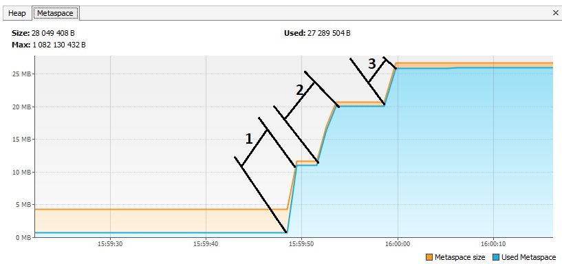
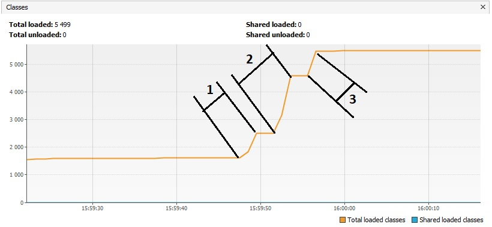
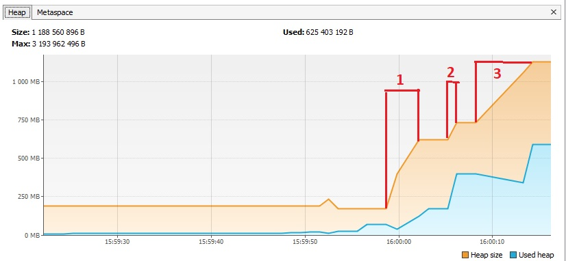

Домашнее задание для Netology.ru для курса Java Developer   

Описание и инструкция к выполнению [здесь](https://github.com/netology-code/jd-homeworks/tree/master/jvm/README.md)

# Описание просиходящего

### Сначала загружается 3 пакета классов в MetaSpace. Это подтверждается графиком памяти metaSpace и графиком загруженных классов.

1. Загрузка классов пакета io.vertx
>15:59:48.369: loading io.vertx
>15:59:49.025: loaded 529 classes 

2. Загрузка классов пакета io.netty
>15:59:52.039: loading io.netty

>15:59:53.075: loaded 2117 classes

3. Загрузка классов пакета org.springframework
>15:59:56.079: loading org.springframework

>15:59:56.423: loaded 869 classes

### Затем создается 3 "банча" объектов

1. Создается 5 млн объектов
>15:59:59.424: creating 5000000 objects

>16:00:02.189: created

2. Создается еще 5 млн объектов
>16:00:05.193: creating 5000000 objects

>16:00:05.584: created

3. Создается еще 5 млн объектов
>16:00:08.618: creating 5000000 objects

>16:00:13.777: created
